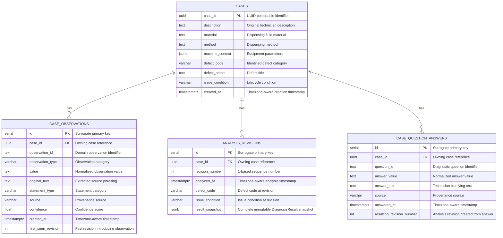

# DispenseIQ — Database Entity-Relationship Specification

## Overview

DispenseIQ uses PostgreSQL with SQLAlchemy 2.x and Alembic migrations for relational persistence.
Schema evolution is strictly governed by Alembic (`backend/alembic/versions/`).

The persistence foundation establishes relational storage for:
1. **Diagnostic cases** (`cases`);
2. **Structured observations with provenance** (`case_observations`);
3. **Append-only immutable analysis revisions** (`analysis_revisions`);
4. **Technician question-answer history** (`case_question_answers`, added in DLK-M3-011).

---

## Entity Relationship Diagram

---

## Table Schemas & Constraints

### 1. `cases`
Stores the top-level investigation record.

| Column | Type | Nullable | Description |
|---|---|---|---|
| `case_id` | `UUID` | No | Primary key, preserving the domain UUID string. |
| `description` | `TEXT` | No | Technician's natural-language symptom description. |
| `material` | `TEXT` | Yes | Dispensing fluid name / chemistry (unrestricted domain string). |
| `method` | `TEXT` | Yes | Dispensing method (e.g. `time_pressure`, `jetting`) (unrestricted domain string). |
| `machine_context` | `JSONB` | Yes | Machine telemetry, parameters, and equipment details. |
| `defect_code` | `VARCHAR(64)` | Yes | Enum-backed defect code (e.g. `D03_INCONSISTENT_SIZE`). |
| `defect_name` | `TEXT` | Yes | Defect title (unrestricted domain string). |
| `issue_condition` | `VARCHAR(64)` | No | State: `UNRESOLVED`, `RECOVERY_PENDING_VERIFICATION`, `RESOLVED`, `RECURRED`. |
| `created_at` | `TIMESTAMPTZ` | No | Timezone-aware case creation timestamp. |

**Constraints:**
- Primary Key: `pk_cases` (`case_id`)

---

### 2. `case_observations`
Stores individual structured observations extracted from user descriptions or provided directly, retaining provenance.

| Column | Type | Nullable | Description |
|---|---|---|---|
| `id` | `SERIAL` | No | Surrogate integer primary key. |
| `case_id` | `UUID` | No | Foreign key referencing `cases.case_id`. |
| `observation_id` | `TEXT` | No | Domain observation identifier (unrestricted domain string). |
| `observation_type` | `VARCHAR(64)` | No | Enum-backed category (e.g. `runtime_pattern`, `deposit_size`). |
| `value` | `TEXT` | No | Normalized value (unrestricted domain string). |
| `original_text` | `TEXT` | Yes | Verbatim phrasing from technician or user input. |
| `statement_type` | `VARCHAR(64)` | No | Enum-backed: `USER_OBSERVATION`, `USER_INTERPRETATION`, `AI_INFERENCE`. |
| `source` | `VARCHAR(64)` | No | Enum-backed provenance: `USER`, `MEASUREMENT`, `IMAGE`, `SYSTEM`, `HISTORICAL_CASE`. |
| `confidence` | `FLOAT` | Yes | Optional inference confidence score. |
| `created_at` | `TIMESTAMPTZ` | No | Timezone-aware timestamp. |
| `first_seen_revision` | `INTEGER` | No | The analysis revision number where this observation first appeared (default `1`). |

**Constraints:**
- Primary Key: `pk_case_observations` (`id`)
- Foreign Key: `fk_case_observations_case_id_cases` (`case_id` -> `cases.case_id` `ON DELETE CASCADE`)
- Unique Constraint: `uq_case_observations_case_id_obs_id` (`case_id`, `observation_id`)
- Check Constraint: `ck_case_observations_first_seen_rev_pos` (`first_seen_revision > 0`)
- Index: `ix_case_observations_case_id` (`case_id`)

---

### 3. `analysis_revisions`
Stores append-only, immutable diagnostic evaluation snapshots.

| Column | Type | Nullable | Description |
|---|---|---|---|
| `id` | `SERIAL` | No | Surrogate integer primary key. |
| `case_id` | `UUID` | No | Foreign key referencing `cases.case_id`. |
| `revision_number` | `INTEGER` | No | 1-based revision sequence number. |
| `analyzed_at` | `TIMESTAMPTZ` | No | Timezone-aware timestamp of analysis pass. |
| `defect_code` | `VARCHAR(64)` | Yes | Defect code assessed at this revision. |
| `issue_condition` | `VARCHAR(64)` | No | Condition state at this revision. |
| `result_snapshot` | `JSONB` | No | Complete immutable `DiagnosisResult` serialized via `model_dump(mode="json")`. |

**Constraints:**
- Primary Key: `pk_analysis_revisions` (`id`)
- Foreign Key: `fk_analysis_revisions_case_id_cases` (`case_id` -> `cases.case_id` `ON DELETE CASCADE`)
- Unique Constraint: `uq_analysis_revisions_case_id_revision_number` (`case_id`, `revision_number`)
- Check Constraint: `ck_analysis_revisions_revision_number_pos` (`revision_number > 0`)
- Index: `ix_analysis_revisions_case_id` (`case_id`)

---

### 4. `case_question_answers`
Stores technician responses to diagnostic questions associated with diagnostic revisions.

| Column | Type | Nullable | Description |
|---|---|---|---|
| `id` | `SERIAL` | No | Surrogate integer primary key. |
| `case_id` | `UUID` | No | Foreign key referencing `cases.case_id`. |
| `question_id` | `TEXT` | No | Diagnostic question identifier (unrestricted domain text). |
| `answer_value` | `TEXT` | No | Normalized answer value (unrestricted domain text, e.g. `after_prolonged_operation`, `YES`, `UNKNOWN`). |
| `answer_text` | `TEXT` | Yes | Technician clarifying comments or verbatim notes. |
| `source` | `VARCHAR(64)` | No | Provenance source (e.g. `USER`). |
| `answered_at` | `TIMESTAMPTZ` | No | Timezone-aware timestamp of the answer submission. |
| `resulting_revision_number` | `INTEGER` | No | Analysis revision number produced by this answer event (> 1). |

**Constraints:**
- Primary Key: `pk_case_question_answers` (`id`)
- Foreign Key: `fk_case_question_answers_case_id_cases` (`case_id` -> `cases.case_id` `ON DELETE CASCADE`)
- Unique Constraint: `uq_case_question_answers_case_id_rev` (`case_id`, `resulting_revision_number`)
- Check Constraint: `ck_case_question_answers_rev_gt_1` (`resulting_revision_number > 1`)
- Index: `ix_case_question_answers_case_id` (`case_id`)

---

## Architectural Guarantees

### 1. JSONB Snapshot Rationale
The `result_snapshot` column stores the full output of Member 2's diagnostic engine without lossy flattening. This preserves:
- All ranked candidate causes with scores and conclusions;
- Complete supporting, contradicting, and neutral evidence traces with provenance, strength, relation, explanation, and score contribution;
- Missing evidence lists and granular score breakdowns;
- Recommended discriminating questions and troubleshooting checks;
- Detailed diagnostic explanation text and engine warnings;
- Internal analysis revision metadata.

### 2. Append-Only Revision Rule
Revisions are strictly append-only:
- `(case_id, revision_number)` is enforced as unique in the database.
- The repository provides no update or delete operations for analysis revisions.
- Attempting to overwrite an existing revision raises an integrity violation.

### 3. Separation of Cause Confirmation and Issue Recovery
In accordance with DispenseIQ diagnostic principles:
- Completing troubleshooting checks does NOT automatically confirm a root cause.
- Confirming a root cause does NOT automatically mean the dispensing defect is resolved.
- Resolving an issue requires independent recovery verification.
- Root cause confirmation and recovery verification remain separate deferred entities in later tasks and are intentionally not coupled into a boolean flag on the case.

### 4. Question-Answer History and Reconstruction Rationale
Technician question answers are stored in `case_question_answers` independently of whether an answer generates an observation:
- Answers mapping to domain observations generate structured rows in `case_observations` with `first_seen_revision = N`.
- Answers such as `UNKNOWN` or `NOT_APPLICABLE` deliberately produce no observations, but their historical record in `case_question_answers` is required so that case reconstruction via `load_structured_case` populates `previous_answers` and prevents the question selection engine from repeatedly re-asking already answered questions.
- In this milestone, exactly one answer produces one new analysis revision (`resulting_revision_number > 1`), enforced by unique constraint `(case_id, resulting_revision_number)`.
- No unique constraint is placed on `(case_id, question_id)`, leaving future capability open for re-answering or corrective workflows.
